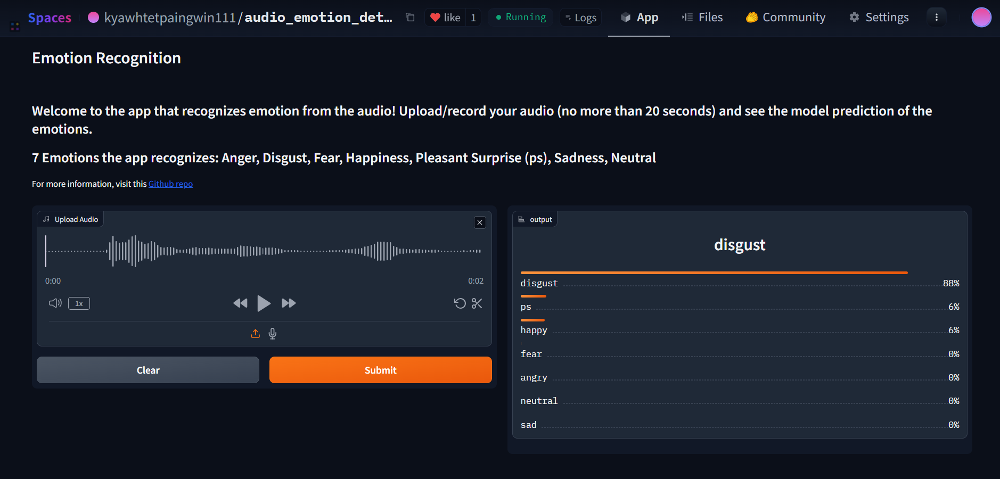
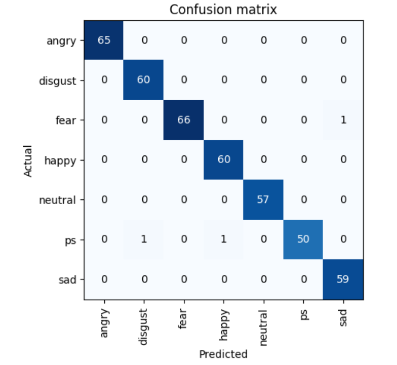
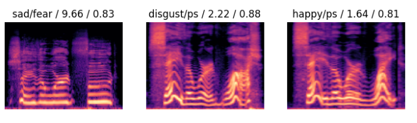

# Emotion Recognition from Audio

## Overview
There are many applications where recognizing emotions from the audio can be helpful (Examples: Interactive voice AI, mental healthcare, and customer call satisfaction).

In this project, I take a novel apporach to build a computer vision model, adapting ResNet, for the classification of emotions from audio recordings.Moreover, I also deployed the model as a web application available where you can upload your audio to detect the emotions in it [Hugging Space](https://huggingface.co/spaces/kyawhtetpaingwin111/audio_emotion_detector). 

Note: The application can become inactive after some time. Below you see an example of the app correctly providing its prediction on an audio recodring saying the word "wife" in disgust. 

## Dataset

The dataset comes from University of Toronto [Tronoto Emotional Speec Set](https://borealisdata.ca/dataset.xhtml?persistentId=doi%3A10.5683%2FSP2%2FE8H2MF) containing 2,800 audio recordings of two actors saying a target word in the phrase "Say the word __".

There are 7 different emotions:
1. Anger
2. Disgust
3. Fear
4. Happiness
5. Pleasant Surprise
6. Sadness
7. Neutral 

Training Dataset Size: 2,380
Test Dataset Size: 420

This is a very small dataset but I wanted to put it into production quickly.

## Folder Strucutre

There are two notebooks you can follow along:

1. **Emotional_Recognition_Training.ipynb**: 
   - Covers from data preprocessing (audio to images/spectograms) to model training/evaluation.

2. **Audio_Emotion_Recognition_Inference.ipynb**: 
   - Taking the model and preparing the steps necessary for Gradio application development

## Main Libraries

1. Fast AI: Model Development
2. Librosa: Audio Data Processing 
3. Gradio/Hugging Face: Web Application development

## Result & Discussion

Even though the model achieved above 99% accuracy in classifying emotions, I wouldn't take this metric at face value mainly because the test data size is pretty small. However, it's more instructive to look at where the model is making mistakes. Let's see the confusion matrix. 

From this, we see that the model often confuses pleasantly surprise with happy and disgust while it confuses fear with sadness. Indeed, these are emotions that are fairly close to each other. Looking at the spectograms where the model goes wrong also show this:

Overall, this model shows really promising results. 

## Next Step:

I would want to get more data to test on and train further if necessary. 
