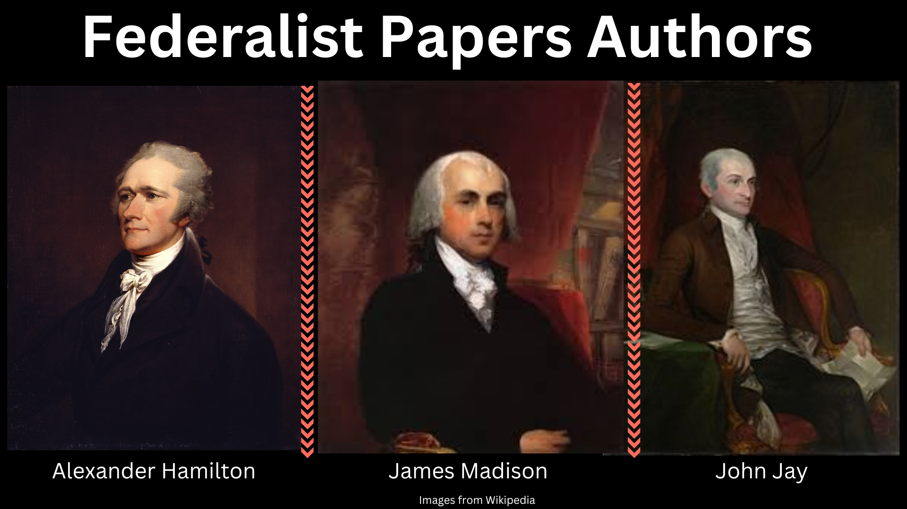
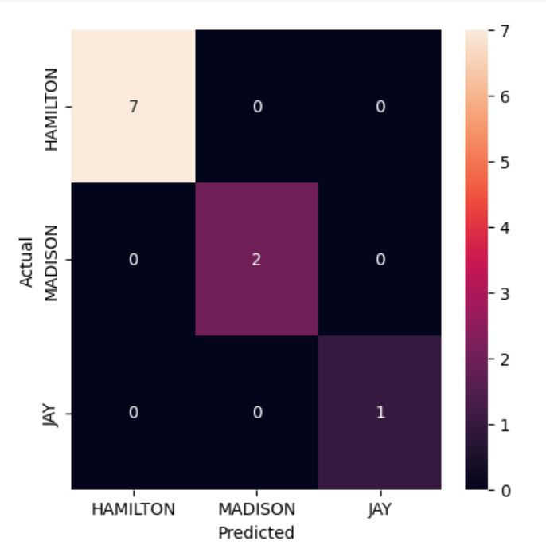
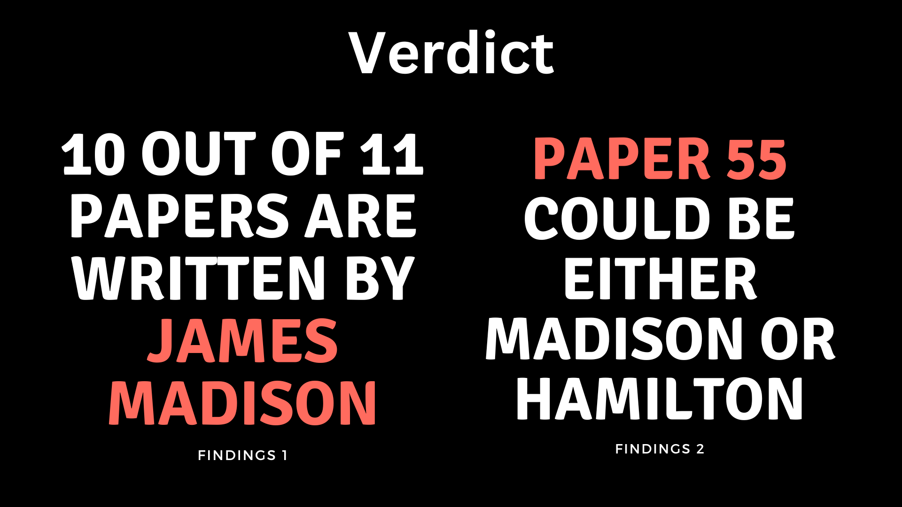

# Introduction 

Following the American Revolutionary War in 1787 when the United States was only a loose collection of states, three of the founders, namely Alexander Hamilton, James Madison, and John Jay published a series of 85 essays known as Federalist Paper where they argue for uniting the states under a centralized government based on representative democracy and rectifying the United States Constitution.

However, 11 of these papers have disputed authorship and remain a topic of debate. In this project, I utilize a language model that Microsoft developed called Deberta to determine the authorship of disputed papers.

Below is the portrait of the authors:

# Dataset

All the papers are found in a directory called federalist-papers and are further processed into two JSON files for model development. 

# Main Libraries

1. LangChain: Loading and preparing the dataset
2. HuggingFace: Processing and training the model
3. Sklearn: Evaluation and metrics

# Fine-Tuning the Model and Evaluation

The papers are broken down into smaller chunks to fit the input size of the model. In the end, the model's final prediction of the author is taken as the mode of all the labels across these chunks. 

The confusion matrix below shows the model performance on the validation set of 10 papers. 

# Verdict

Below is the summary of the model verdict.

For details, check out the notebook.
