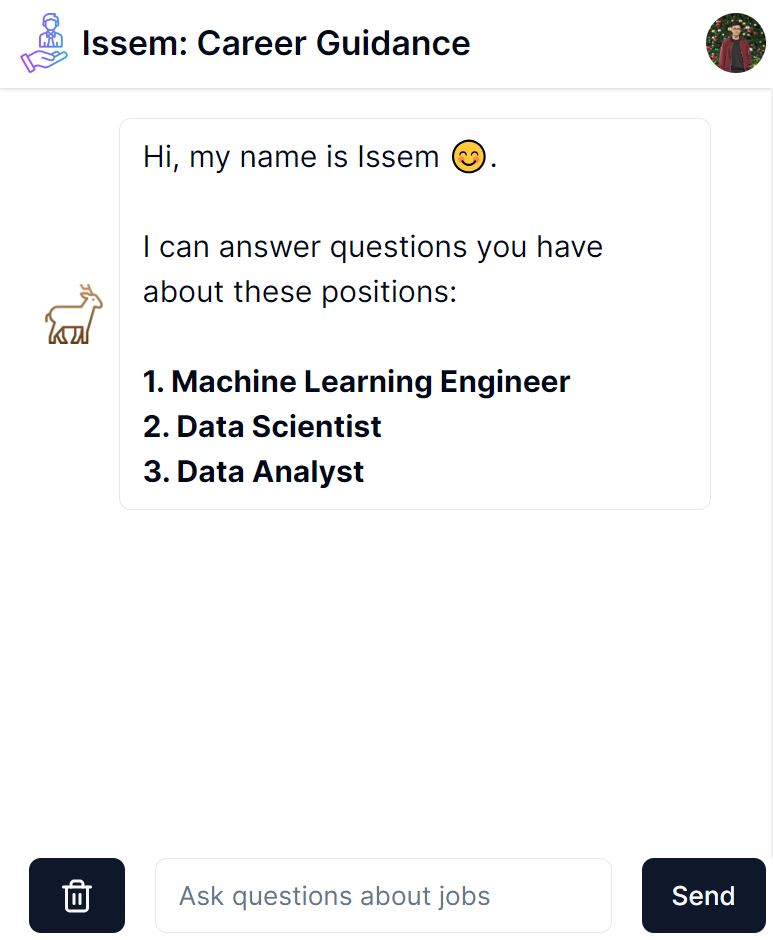
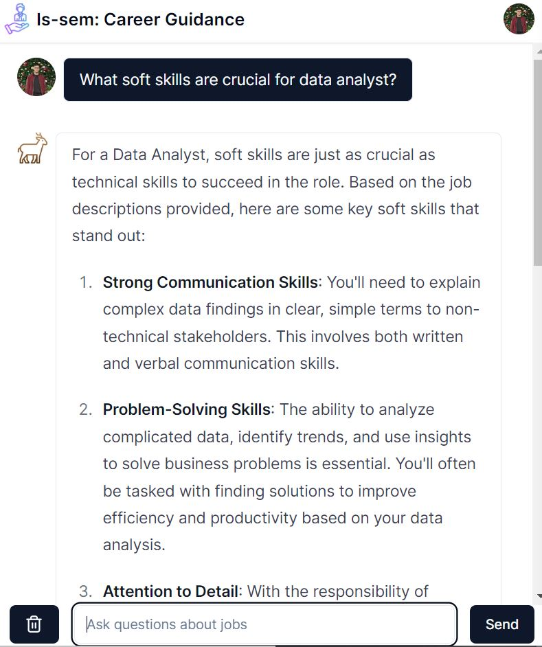
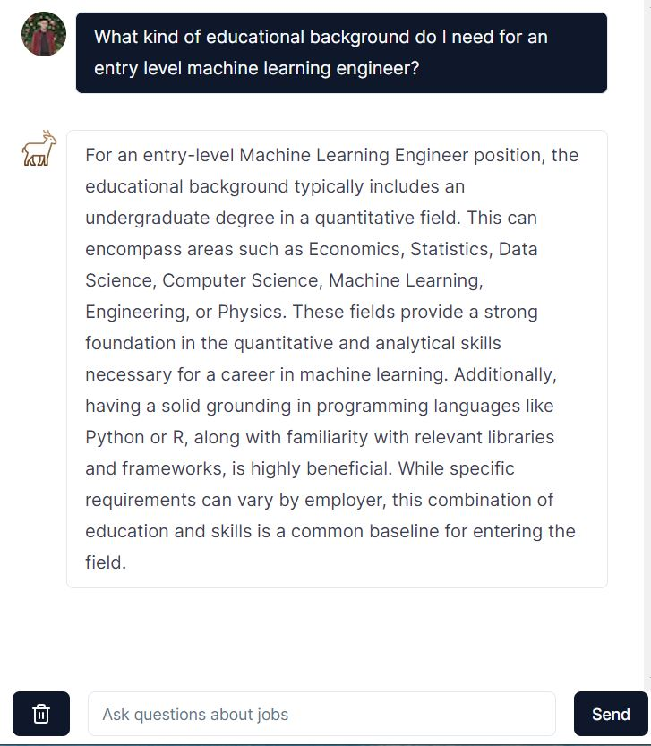

# About & Motivation

## Problem Statement:

* Many existing career resources often provide generic advice and people are left in the wild about different career choices.

## Solution:

* Is-sem is a web application I am developing to make career exploration simple.
* Is-sem is currently able to provide nuanced responses to user's career-related questions by referring to real job descriptions.

## Tech Stack:

* NextJS, React, TailWind CSS, Shadcn, TypeScript: Full-stack web application.
* LangChain, Pinecone, and GPT-model: Indexing job descriptions & answering user question
* MongDB/Prisma: Stores information about user & covnersational history for future development
* Clerk: User Authorization

## Demo showing the app features:

