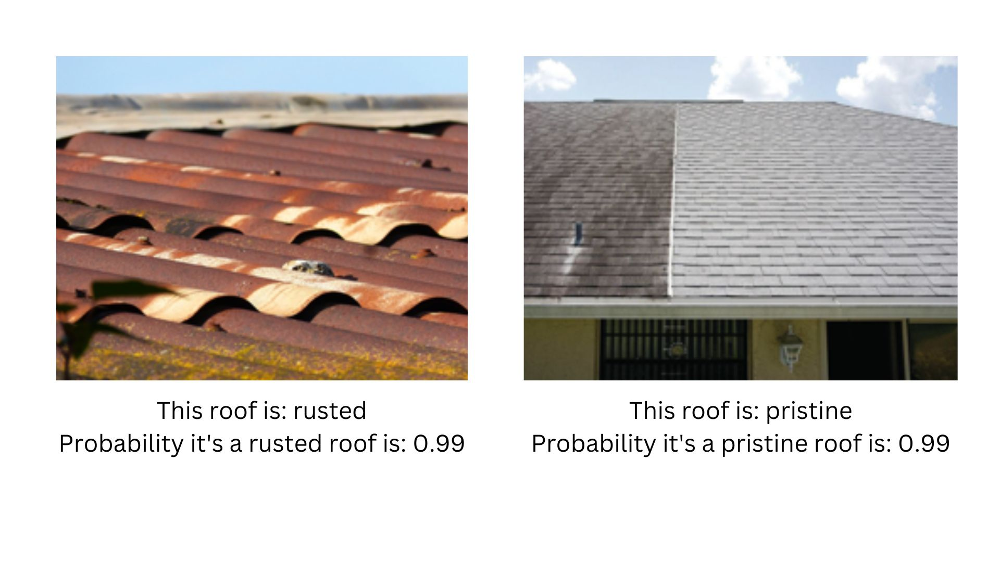

# Detecting Roof Rust with Machine Learning

## Overview
In this notebook, I build a machine learning model to identify roofs corroded with rust. This is a quick prototype to see what's possible by adapting the ResNet model for rust detection, and the results
are quite promising. 

## Problem Statement
Rust on roofs is not just a cosmetic issue; it can lead to severe structural problems, such as water leakage. Timely detection is crucial for maintenance and prevention of further damage.

## Approach
The project uses the ResNet architecture, a renowned model in computer vision, to classify images of roofs into rusted or non-rusted categories. The images for training and testing were sourced from Duck Duck Go.

## Results
- The model attained an accuracy of 91% on the test dataset after five training iterations.
- This initial success showcases the model's potential in automating and improving roof inspection processes.

## Notebook Contents
- Detailed explanation of the problem and solution approach.
- Steps for data acquisition and preprocessing.
- Model training and evaluation process.
- Visualizations and insights from the test results.

## Results

The image below shows a model correctly distinguishing between rust/pristine roofs. 

## Future Directions
- Dataset expansion for enhanced accuracy and generalizability.
- Potential integration into a user-friendly app for widespread adoption in roof inspection.